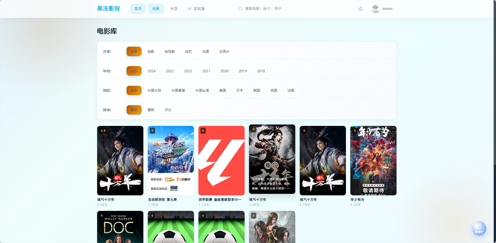
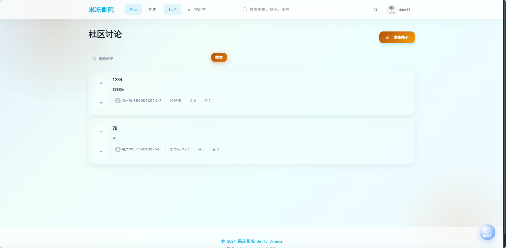
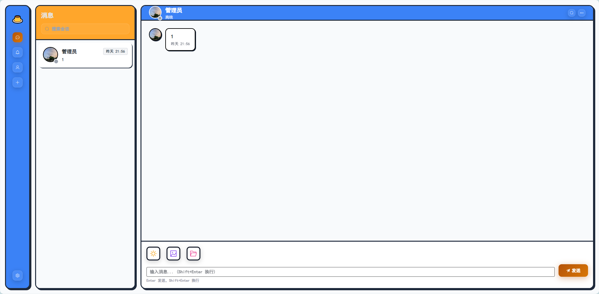
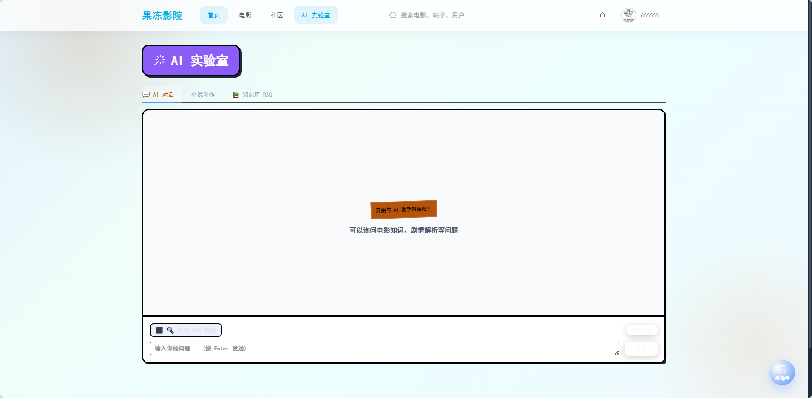
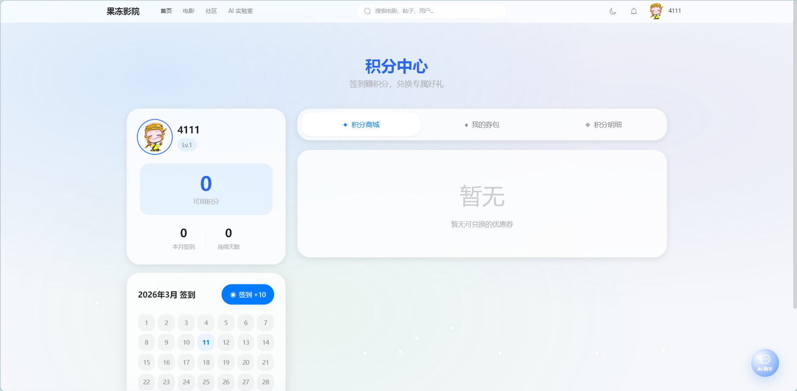

<div align="center">

<p align="center">
  
</p>

#  **果冻影院 2.0** (Jelly Cinema)

### **影视** · **社交** · **AI** · **RAG** · **积分**

**新一代全栈微服务平台 | Spring Cloud + Vue3 + AI 赋能**

[](https://spring.io/projects/spring-boot)
[](https://vuejs.org/)
[](https://www.elastic.co/)
[](LICENSE)

[**� 快速开始**](#-快速开始) · [**✨ 功能亮点**](#-功能亮点) · [**🏗️ 技术架构**](#️-技术栈) · [**📄 API 文档**](#-api-接口)

</div>

---

## ✨ **功能亮点**

<table>
<tr>
<td width="50%">

### 🎬 **沉浸式影视中心**
- 🔥 **AI 精选推荐**: 基于用户行为的个性化推荐
- 🔍 **混合检索**: SQL + ES 倒排 + 向量语义搜索
- 🏆 **动态榜单**: 实时热度排行与新片速递
- 📺 **多端适配**: Web端 + TVBox 电视端支持

</td>
<td width="50%">

### 💬 **实时通讯 (IM)**
- ⚡ **WebSocket**: 低延迟私聊/群聊 (Netty)
- � **云端存储**: 消息漫游与多端同步
- � **富媒体**: 图片/文件/代码块发送
- ↩️ **交互增强**: 消息撤回/已读回执/正在输入

</td>
</tr>
<tr>
<td width="50%">

### 📝 **极客社区**
- ✍️ **Markdown**: 极致的富文本编辑体验
- 👍 **互动投票**: 仿知乎风格的高质量问答
- 🏷️ **圈子话题**: 聚合兴趣内容与热门讨论
- 👮 **内容风控**: 敏感词过滤与自动审核

</td>
<td width="50%">

### 🤖 **AI 实验室 (RAG)**
- 🧠 **多模态对话**: 集成 DeepSeek/GLM 等大模型
- � **知识库 RAG**: 基于文档的精准问答 (Python)
- 🎭 **角色扮演**: 沉浸式 AI 角色聊天
- ✍️ **辅助创作**: AI 续写小说与大纲生成

</td>
</tr>
<tr>
<td width="50%">

### 🎁 **积分权益体系**
- 📅 **签到打卡**: 连续签到奖励与补签
- 💳 **商城兑换**: 积分兑换 VIP 与优惠券
- 🏅 **等级特权**: 动态成长的会员体系
- 📊 **账单流水**: 透明的积分消费记录

</td>
<td width="50%">

### �️ **企业级后台管理**
- � **RBAC 权限**: 细粒度的菜单与按钮控制
- � **数据大屏**: 实时监控系统核心指标
- � **用户画像**: 全方位的用户行为分析
- � **内容审计**: 评论/帖子的审核工作流

</td>
</tr>
</table>

## 📸 **界面预览**

### 🏠 **首页 (Home)**


### 🎬 **电影中心 (Movies)**


### 📝 **社区论坛 (Community)**


### 💬 **即时通讯 (IM)**


### 🤖 **AI 实验室 (AI Lab)**


### 🎁 **积分中心 (Points)**


## 📋 项目简介

果冻影院是一个**全栈微服务项目**，采用前后端分离架构，集影视浏览、实时通讯、社区互动、AI 智能于一体。用户可以在观影时即时聊剧，在社区深度讨论，并通过 AI 助手获取增强信息或生成衍生小说内容。

**适用场景**：
- 🎓 学习微服务架构的完整实战项目
- 💼 求职面试的亮眼作品集
- 🚀 二次开发的基础框架

## 🏗️ **技术栈**

### **后端 (Backend)**
> 基于 Spring Boot 3.2 + Spring Cloud Alibaba 2023 构建的高性能微服务架构

- **核心框架**: `Spring Boot 3.2.5`, `Spring Cloud 2023.0.1`, `Spring Cloud Alibaba 2023.0.1.0`
- **开发语言**: `Java 21` (最新 LTS 版本)
- **服务治理**: `Nacos 2.3` (注册中心 & 配置中心)
- **数据库**: `MySQL 8.0.33` + `MyBatis Plus 3.5.5`
- **缓存架构**: `Redis 7.0` (Redisson 3.27) + `Caffeine` (多级缓存)
- **搜索引擎**: `Elasticsearch 7.6.2` (IK 分词器)
- **消息队列**: `RocketMQ 4.9.4` (削峰填谷 & 异步解耦)
- **安全认证**: `Sa-Token 1.37` + `JWT` (RBAC 权限模型)
- **AI 能力**: `Spring AI`, `LangChain4j`, `Python FastApi` (RAG 服务)

### **前端 (Frontend)**
> 采用 Vue 3 + TypeScript + Vite 5 的现代化前端技术栈

- **核心框架**: `Vue 3.4` (Composition API)
- **构建工具**: `Vite 5.2.8` (极速构建)
- **开发语言**: `TypeScript 5.4` (类型安全)
- **状态管理**: `Pinia 2.1` (新一代状态管理)
- **UI 组件库**: `Element Plus 2.6` (暗黑模式支持)
- **样式方案**: `TailwindCSS 3.4` + `Sass`
- **媒体组件**: `DPlayer` (HLS 流媒体播放), `ECharts 5.6` (数据可视化)

---

## � **项目结构**

```bash
jelly-cinema-v2/
├── 📂 jelly-gateway          # [9000] API 网关 (统一入口/限流/鉴权)
├── 📂 jelly-auth             # [9100] 认证中心 (登录/注册/SSO单点登录)
├── 📂 jelly-admin            # [9600] 运营后台 (数据大屏/用户管理/内容审核) [NEW]
├── 📂 jelly-modules/         # 业务微服务聚合
│   ├── jelly-film            # [9200] 影视服务 (影片管理/推荐算法/榜单)
│   ├── jelly-community       # [9300] 社区服务 (圈子/帖子/互动/投票)
│   ├── jelly-im              # [9400] 即时通讯 (WebSocket/群聊/私聊)
│   └── jelly-ai              # [9500] AI 实验室 (LLM对话/小说生成/角色扮演)
├── 📂 jelly-rag-python/      # [8000] RAG 检索引擎 (Python/LangChain/向量库) [NEW]
├── 📂 tvbox-proxy/           # [5000] TVBox 接口代理 (TV端源解析) [NEW]
├── 📂 jelly-common/          # 公共依赖模块 (Core/Redis/MyBatis/Security)
├── 📂 jelly-ui-web/          # 前端 Web 端源码 (Vue3 + TS)
└── 📄 docker-compose.yml     # 容器化一键部署脚本
```

---

## 🚀 **快速开始**

### **1. 环境准备**
- JDK 21+
- Node.js 18+
- Docker & Docker Compose
- Maven 3.9+

### **2. 启动中间件**

```bash
# 启动 MySQL, Redis, Nacos, Elasticsearch, RocketMQ, MinIO
docker-compose up -d
```

### **3. 初始化配置**
1. 导入数据库脚本: `doc/sql/jelly_cinema.sql`
2. 修改 Nacos 配置: 访问 `localhost:8848` (nacos/nacos)

### **4. 启动服务**

```bash
# 建议启动顺序
1. jelly-gateway      (网关)
2. jelly-auth         (认证)
3. jelly-film         (核心业务)
4. jelly-rag-python   (AI 搜索增强 - 可选)
   cd jelly-rag-python && pip install -r requirements.txt && python main.py
```

### **5. 启动前端**

```bash
cd jelly-ui-web
npm install
npm run dev
# 访问 http://localhost:5173
```

## 📡 API 接口

### 认证服务 (/auth)
- `POST /auth/login` - 登录
- `POST /auth/register` - 注册
- `POST /auth/logout` - 退出登录
- `GET /auth/user/info` - 获取用户信息

### 电影服务 (/film)
- `GET /film/list` - 电影列表
- `GET /film/detail/{id}` - 电影详情
- `GET /film/search` - 搜索电影
- `GET /film/recommend/feed` - 推荐电影
- `GET /film/recommend/hot` - 热门榜单
- `GET /film/category/list` - 分类列表

### 社区服务 (/post, /comment)
- `GET /post/list` - 帖子列表
- `GET /post/detail/{id}` - 帖子详情
- `POST /post/create` - 发布帖子
- `POST /post/vote/{id}` - 投票（赞同/反对）
- `GET /comment/list/{postId}` - 评论列表
- `POST /comment/create` - 发布评论
- `POST /comment/like/{id}` - 点赞评论

### IM 服务 (/im, /ws)
- `GET /im/sessions` - 会话列表
- `GET /im/history/{sessionId}` - 历史消息
- `POST /im/recall/{messageId}` - 撤回消息
- `WS /ws/chat?token=xxx` - WebSocket 连接

### AI 服务 (/ai)
- `POST /ai/chat` - 同步对话
- `POST /ai/chat/stream` - 流式对话 (SSE)
- `POST /ai/novel/generate-outline` - 生成小说大纲
- `POST /ai/novel/generate-chapter` - 生成章节内容 (SSE)
- `POST /ai/rag/upload` - 上传 RAG 文档
- `GET /ai/rag/search` - RAG 检索
 

## ⚙️ 环境变量配置

复制 `.env.example` 为 `.env` 并配置：

```bash
# 数据库
MYSQL_HOST=localhost
MYSQL_PASSWORD=your_password

# Redis
REDIS_HOST=localhost

# 腾讯云 COS
COS_SECRET_ID=your_cos_secret_id
COS_SECRET_KEY=your_cos_secret_key
COS_BUCKET=your_bucket

# AI API
AI_SILICONFLOW_KEY=your_siliconflow_key
AI_DEEPSEEK_KEY=your_deepseek_key
```

## 📝 开发规范

-  遵循阿里巴巴 Java 开发手册
-  使用 Lombok 简化代码
-  RESTful API 设计规范
-  统一响应格式 `R<T>`
-  全局异常处理
-  Sa-Token 权限控制
-  MyBatis Plus 通用 CRUD

## 🤝 贡献指南

1. Fork 本仓库
2. 创建特性分支 (`git checkout -b feature/AmazingFeature`)
3. 提交更改 (`git commit -m 'Add some AmazingFeature'`)
4. 推送到分支 (`git push origin feature/AmazingFeature`)
5. 提交 Pull Request

## 📄 开源协议

本项目采用 [MIT License](LICENSE) 开源协议。

## 🙏 致谢

- [Spring Boot](https://spring.io/projects/spring-boot)
- [Vue.js](https://vuejs.org/)
- [Element Plus](https://element-plus.org/)
- [TailwindCSS](https://tailwindcss.com/)
- [DeepSeek](https://www.deepseek.com/)
- [SiliconFlow](https://siliconflow.cn/)

---

<div align="center">

**🍮 果冻影院 2.0** - 让看剧更有趣

如果这个项目对你有帮助，请给一个 ⭐ Star 支持一下！

<p align="center">
  Made with ❤️ by <a href="https://github.com/ZSPSTRIVE">ZSPSTRIVE</a>
</p>


</div>
