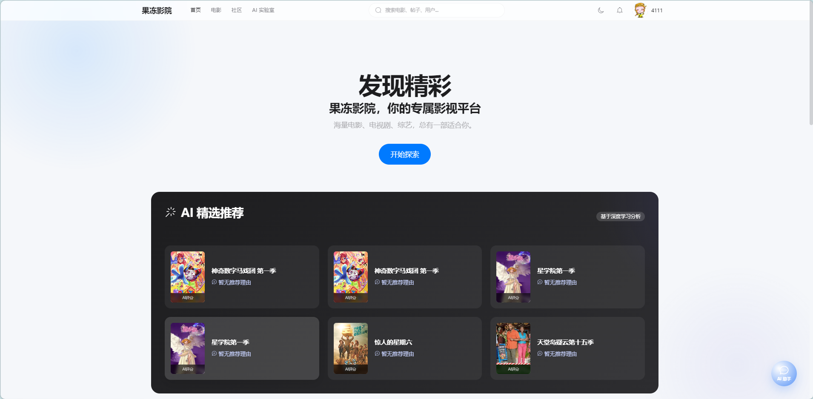
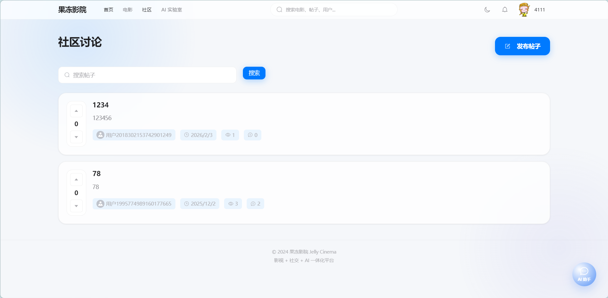
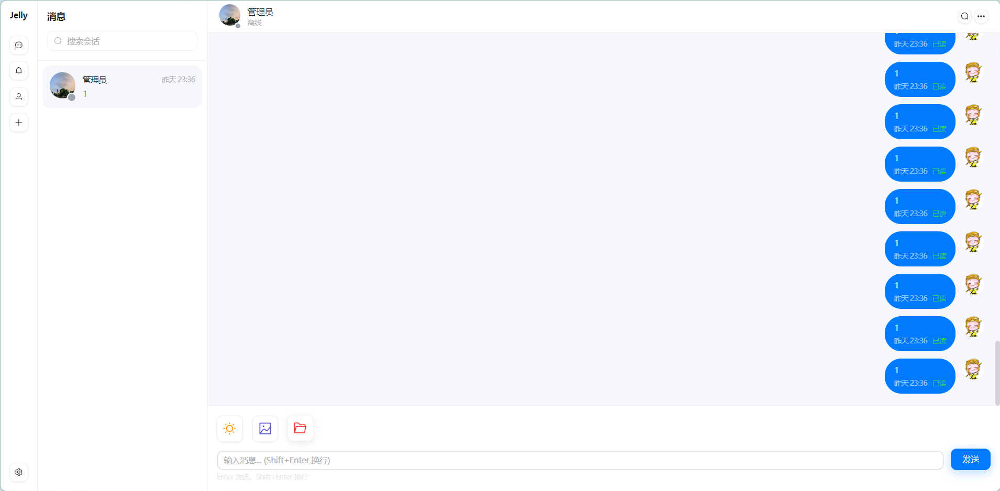
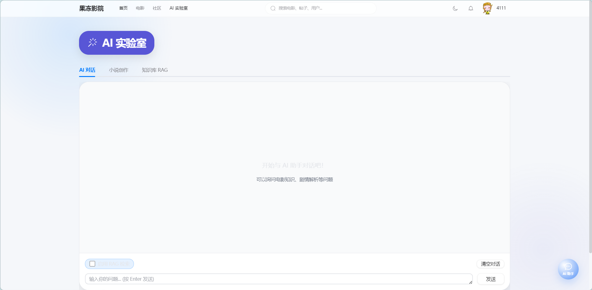

<div align="center">

# 🍮 果冻影院 2.0

### Jelly Cinema - 影视 + 社交 + AI 一体化微服务平台

[](https://spring.io/projects/spring-boot)
[](https://vuejs.org/)
[](LICENSE)


**🎬 看剧 · 💬 聊剧 · 🤖 AI 助手 · 📝 社区讨论**

[快速开始](#-快速开始) · [功能亮点](#-功能亮点) · [技术栈](#️-技术栈) · [API 文档](#-api-接口)

</div>

---

## ✨ 功能亮点

<table>
<tr>
<td width="50%">

### 🎬 影视中心
- 🔥 热门推荐 & 个性化推荐
- 🔍 智能搜索 & 分类筛选
- ⭐ 评分评论 & 收藏追剧
- 📊 榜单排行 & 新片速递

</td>
<td width="50%">

### 💬 即时通讯
- 👥 私聊 & 群聊
- 📷 图片 & 文件传输
- 🔔 消息通知 & 在线状态
- ↩️ 消息撤回 & 已读回执

</td>
</tr>
<tr>
<td width="50%">

### 📝 社区论坛
- 📄 帖子发布 & Markdown 支持
- 👍 投票系统 (仿知乎)
- 💬 多级评论 & 点赞
- 🏷️ 标签分类 & 热门话题

</td>
<td width="50%">

### 🤖 AI 助手
- 💡 智能对话 (多 AI 提供商)
- 📖 AI 小说生成
- 🔍 RAG 知识库检索
- ⚡ 流式响应 & 故障转移

</td>
</tr>
</table>

## 📸 界面预览

### 🏠 首页


### 🎬 电影中心


### 📝 社区论坛


### 💬 即时通讯


### 🤖 AI 助手


## 📋 项目简介

果冻影院是一个**全栈微服务项目**，采用前后端分离架构，集影视浏览、实时通讯、社区互动、AI 智能于一体。用户可以在观影时即时聊剧，在社区深度讨论，并通过 AI 助手获取增强信息或生成衍生小说内容。

**适用场景**：
- 🎓 学习微服务架构的完整实战项目
- 💼 求职面试的亮眼作品集
- 🚀 二次开发的基础框架

## 🏗️ 技术栈

### 后端
- **框架**: Spring Boot 3.2+, Spring Cloud Alibaba
- **注册/配置中心**: Nacos
- **消息队列**: RocketMQ 4.9.x
- **数据库**: MySQL 8.0
- **缓存**: Redis 6.2, Caffeine
- **搜索引擎**: Elasticsearch 7.6
- **认证**: Sa-Token
- **AI**: LangChain4j, Spring AI

### 前端
- **框架**: Vue 3 (Composition API)
- **构建工具**: Vite
- **状态管理**: Pinia
- **UI 组件**: Element Plus
- **样式**: TailwindCSS

## 📁 项目结构

```
jelly-cinema-v2/
├── jelly-gateway          # API 网关 (8080)
├── jelly-auth             # 认证服务 (9100)
├── jelly-modules/
│   ├── jelly-film         # 电影服务 (9200) - 电影列表/详情/搜索/推荐
│   ├── jelly-community    # 社区服务 (9300) - 帖子/评论/投票（仿知乎）
│   ├── jelly-im           # IM 服务 (9400) - WebSocket实时通讯/RocketMQ
│   └── jelly-ai           # AI 服务 (9500) - RAG问答/小说生成/LLM对话
├── jelly-common/          # 公共模块
│   ├── jelly-common-core      # 核心工具类
│   ├── jelly-common-redis     # Redis 模块
│   ├── jelly-common-mybatis   # MyBatis Plus 模块
│   └── jelly-common-security  # 安全认证模块
├── jelly-ui-web/          # 前端项目 (Vue3)
├── doc/
│   └── sql/               # 数据库脚本
└── docker-compose.yml     # Docker 编排
```

## 🚀 快速开始

### 1. 启动中间件

```bash
# 启动 MySQL, Redis, Nacos, Elasticsearch, RocketMQ, MinIO
docker-compose up -d
```

### 2. 初始化数据库

```bash
# 执行 doc/sql/jelly_cinema.sql 初始化数据库
```

### 3. 启动后端服务

```bash
# 按顺序启动服务
1. jelly-gateway (网关)
2. jelly-auth (认证)
3. jelly-film (电影)
```

### 4. 启动前端

```bash
cd jelly-ui-web
npm install
npm run dev
```

## 📡 API 接口

### 认证服务 (/auth)
- `POST /auth/login` - 登录
- `POST /auth/register` - 注册
- `POST /auth/logout` - 退出登录
- `GET /auth/user/info` - 获取用户信息

### 电影服务 (/film)
- `GET /film/list` - 电影列表
- `GET /film/detail/{id}` - 电影详情
- `GET /film/search` - 搜索电影
- `GET /film/recommend/feed` - 推荐电影
- `GET /film/recommend/hot` - 热门榜单
- `GET /film/category/list` - 分类列表

### 社区服务 (/post, /comment)
- `GET /post/list` - 帖子列表
- `GET /post/detail/{id}` - 帖子详情
- `POST /post/create` - 发布帖子
- `POST /post/vote/{id}` - 投票（赞同/反对）
- `GET /comment/list/{postId}` - 评论列表
- `POST /comment/create` - 发布评论
- `POST /comment/like/{id}` - 点赞评论

### IM 服务 (/im, /ws)
- `GET /im/sessions` - 会话列表
- `GET /im/history/{sessionId}` - 历史消息
- `POST /im/recall/{messageId}` - 撤回消息
- `WS /ws/chat?token=xxx` - WebSocket 连接

### AI 服务 (/ai)
- `POST /ai/chat` - 同步对话
- `POST /ai/chat/stream` - 流式对话 (SSE)
- `POST /ai/novel/generate-outline` - 生成小说大纲
- `POST /ai/novel/generate-chapter` - 生成章节内容 (SSE)
- `POST /ai/rag/upload` - 上传 RAG 文档
- `GET /ai/rag/search` - RAG 检索
 

## ⚙️ 环境变量配置

复制 `.env.example` 为 `.env` 并配置：

```bash
# 数据库
MYSQL_HOST=localhost
MYSQL_PASSWORD=your_password

# Redis
REDIS_HOST=localhost

# 腾讯云 COS
COS_SECRET_ID=your_cos_secret_id
COS_SECRET_KEY=your_cos_secret_key
COS_BUCKET=your_bucket

# AI API
AI_SILICONFLOW_KEY=your_siliconflow_key
AI_DEEPSEEK_KEY=your_deepseek_key
```

## 📝 开发规范

- ✅ 遵循阿里巴巴 Java 开发手册
- ✅ 使用 Lombok 简化代码
- ✅ RESTful API 设计规范
- ✅ 统一响应格式 `R<T>`
- ✅ 全局异常处理
- ✅ Sa-Token 权限控制
- ✅ MyBatis Plus 通用 CRUD

## 🤝 贡献指南

1. Fork 本仓库
2. 创建特性分支 (`git checkout -b feature/AmazingFeature`)
3. 提交更改 (`git commit -m 'Add some AmazingFeature'`)
4. 推送到分支 (`git push origin feature/AmazingFeature`)
5. 提交 Pull Request

## 📄 开源协议

本项目采用 [MIT License](LICENSE) 开源协议。

## 🙏 致谢

- [Spring Boot](https://spring.io/projects/spring-boot)
- [Vue.js](https://vuejs.org/)
- [Element Plus](https://element-plus.org/)
- [TailwindCSS](https://tailwindcss.com/)
- [DeepSeek](https://www.deepseek.com/)
- [SiliconFlow](https://siliconflow.cn/)

---

<div align="center">

**🍮 果冻影院 2.0** - 让看剧更有趣

如果这个项目对你有帮助，请给一个 ⭐ Star 支持一下！

<p align="center">
  Made with ❤️ by <a href="https://github.com/ZSPSTRIVE">ZSPSTRIVE</a>
</p>


</div>
